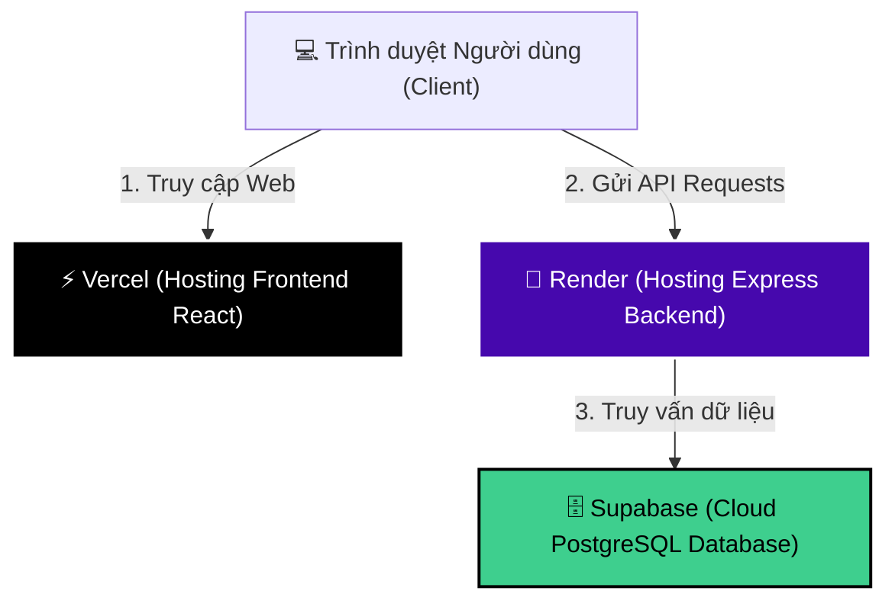

# Hướng Dẫn Triển Khai Hệ Thống Sales & Warehouse Management Lên Hosting Miễn Phí (100% Free)

Chào bạn! Dưới đây là tài liệu hướng dẫn chi tiết từng bước từ A đến Z để bạn đưa toàn bộ hệ thống của mình (bao gồm React Frontend, Express Backend và Cơ sở dữ liệu PostgreSQL) lên internet hoạt động **24/7 hoàn toàn miễn phí**.

Để chạy ứng dụng thực tế một cách ổn định nhất, chúng ta sẽ áp dụng mô hình kiến trúc đám mây tối ưu và phổ biến nhất hiện nay:

> [!NOTE]
> * **Frontend (React)**: Triển khai trên **Vercel** (Miễn phí, tốc độ tải cực nhanh, tự động đồng bộ từ GitHub).
> * **Backend (Express)**: Triển khai trên **Render** (Miễn phí cho Web Service, chạy mượt mà gói Node.js).
> * **Cơ sở dữ liệu (PostgreSQL)**: Triển khai trên **Supabase** (Cung cấp database PostgreSQL chất lượng cao miễn phí vĩnh viễn).

---

## 🗺️ Sơ Đồ Hoạt Động (Production)



---

## 🛠️ BƯỚC 1: ĐẨY MÃ NGUỒN LÊN GITHUB (CHUẨN BỊ MONOREPO)

Dự án của bạn được thiết kế dạng **Monorepo** (có cả thư mục `frontend/` và `backend/` chung một thư mục gốc). Chúng ta sẽ đẩy toàn bộ thư mục gốc này lên một kho lưu trữ (Repository) trên GitHub.

1. Truy cập [GitHub](https://github.com) và đăng ký/đăng nhập.
2. Nhấp vào nút **New** (hoặc dấu cộng ở góc phải) để tạo một **Repository mới**:
   * **Repository name**: Đặt tên bất kỳ (ví dụ: `sales-warehouse-system`).
   * **Public/Private**: Chọn **Private** (Riêng tư) để bảo mật mã nguồn và các mật khẩu cấu hình.
   * *Không tích chọn các mục Add README, .gitignore hay license.*
   * Nhấp nút **Create repository**.
3. Mở Terminal / Command Prompt tại thư mục gốc của dự án (`c:\Users\Acer\Downloads\ai`) và chạy tuần tự các lệnh sau:
   ```bash
   git init
   git add .
   git commit -m "feat: prepare project for production deployment"
   git branch -M main
   git remote add origin <ĐƯỜNG_DẪN_REPOSITORY_GITHUB_CỦA_BẠN>
   git push -u origin main
   ```
   *(Đường dẫn GitHub của bạn có dạng: `https://github.com/tên-tài-khoản/tên-repository.git`)*

---

## 🗄️ BƯỚC 2: TẠO CƠ SỞ DỮ LIỆU POSTGRESQL MIỄN PHÍ TRÊN SUPABASE

Vì cơ sở dữ liệu mặc định ở local của bạn là **SQLite** (dữ liệu lưu trên máy cá nhân), khi đưa lên đám mây, chúng ta phải sử dụng một Database online. **Supabase** là dịch vụ PostgreSQL miễn phí tốt nhất.

1. Truy cập [Supabase](https://supabase.com) và đăng nhập bằng tài khoản GitHub của bạn.
2. Chọn **New Project** -> Chọn tổ chức của bạn.
3. Điền các thông tin dự án:
   * **Name**: `sales-warehouse-db`
   * **Database Password**: Nhập mật khẩu bảo mật của riêng bạn (hãy lưu lại mật khẩu này ra file nháp, bạn sẽ cần nó!).
   * **Region**: Chọn khu vực gần Việt Nam nhất là **Singapore (ap-southeast-1)** để tải nhanh nhất.
   * **Pricing Plan**: Chọn gói **Free** (Miễn phí).
4. Nhấn **Create new project** và đợi 2-3 phút để hệ thống thiết lập cơ sở dữ liệu.
5. Khi Database đã sẵn sàng, đi tới mục **Project Settings** (biểu tượng bánh răng ⚙️ ở góc dưới cùng bên trái) -> Chọn **Database** (nằm ở menu dọc bên trái).
6. Cuộn xuống phần **Connection parameters** và copy lại các thông số sau để sử dụng ở Bước 3:
   * **Host**: (Ví dụ: `aws-0-ap-southeast-1.pooler.supabase.com`)
   * **Database Name**: `postgres` (Thường mặc định là postgres)
   * **Port**: `6543` *(Nên chọn cổng 6543 để tối ưu kết nối cloud)*
   * **User**: `postgres`
   * **Password**: Mật khẩu bạn đã tự đặt ở trên.

---

## 🚀 BƯỚC 3: TRIỂN KHAI BACKEND API LÊN RENDER.COM

Render sẽ đảm nhận việc biên dịch và chạy dịch vụ Node.js Backend 24/7.

1. Đăng nhập vào [Render.com](https://render.com) bằng tài khoản GitHub của bạn.
2. Nhấn nút **New +** ở góc phải màn hình -> Chọn **Web Service**.
3. Chọn **Build and deploy from a Git repository** và nhấn **Next**.
4. Kết nối tài khoản GitHub và chọn Repository dự án mà bạn vừa đẩy lên ở Bước 1.
5. Cấu hình dịch vụ Backend với các thông số cực kỳ quan trọng sau:
   * **Name**: `sales-warehouse-backend`
   * **Region**: Chọn cùng khu vực với Database Supabase là **Singapore**.
   * **Branch**: `main`
   * **Root Directory**: Nhập `backend` *(Bắt buộc phải điền để Render chỉ chạy phần backend)*
   * **Runtime**: `Node`
   * **Build Command**: `npm install`
   * **Start Command**: `node src/index.js`
   * **Instance Type**: Chọn gói **Free** ($0/month).
6. Nhấp vào mục **Advanced** (Nâng cao) ở bên dưới để thêm các **Environment Variables (Biến môi trường)**:

| Tên biến (Key) | Giá trị (Value) | Giải thích |
| :--- | :--- | :--- |
| `NODE_ENV` | `production` | Kích hoạt chế độ sản xuất & kết nối SSL Postgres |
| `USE_SQLITE` | `false` | Bắt buộc để chuyển kết nối từ SQLite sang PostgreSQL |
| `DB_HOST` | *(Dán Host copy từ Supabase)* | Địa chỉ máy chủ database cloud |
| `DB_PORT` | `6543` | Cổng kết nối tối ưu của PostgreSQL Supabase |
| `DB_NAME` | `postgres` | Tên database mặc định |
| `DB_USER` | `postgres` | Tên người dùng database mặc định |
| `DB_PASSWORD` | *(Mật khẩu Supabase của bạn)* | Mật khẩu database bạn đã tự đặt ở Bước 2 |
| `JWT_SECRET` | *(Một chuỗi chữ và số dài tùy chọn)* | Khóa bí mật dùng để mã hóa mã đăng nhập (JWT) |
| `CORS_ORIGIN` | `https://your-frontend.vercel.app` | *Tạm thời điền một đường dẫn bất kỳ, chúng ta sẽ cập nhật lại sau khi hoàn thành Bước 4* |

7. Nhấp nút **Create Web Service** ở cuối trang.
8. Quá trình cài đặt thư viện và khởi chạy sẽ diễn ra trong khoảng 3-4 phút. Khi màn hình xuất hiện thông báo màu xanh lá **`Live`**, bạn hãy sao chép **đường dẫn URL Backend** ở ngay dưới tên Web Service của bạn (ví dụ: `https://sales-warehouse-backend.onrender.com`).

---

## ⚡ BƯỚC 4: TRIỂN KHAI FRONTEND REACT LÊN VERCEL

Vercel là nền tảng máy chủ lưu trữ tối ưu nhất hiện nay cho các ứng dụng React.

1. Truy cập [Vercel.com](https://vercel.com) và chọn đăng nhập bằng GitHub.
2. Tại màn hình Dashboard, nhấn **Add New...** -> Chọn **Project**.
3. Tìm dự án của bạn từ danh sách GitHub và nhấn **Import**.
4. Cấu hình dự án (Vô cùng quan trọng vì cấu trúc thư mục dạng Monorepo):
   * **Framework Preset**: Giữ nguyên (Vercel tự động nhận diện `Create React App`).
   * **Root Directory**: Nhấn nút **Edit** và chọn thư mục **`frontend`** rồi nhấn **Continue**.
   * **Build and Output Settings**: Giữ nguyên mọi thông số mặc định.
5. Nhấp mở rộng mục **Environment Variables** để cấu hình đường dẫn API:
   * **Key**: `REACT_APP_API_URL`
   * **Value**: Dán **URL Backend** bạn đã copy từ Render ở Bước 3 **và thêm `/api` ở cuối** (Ví dụ: `https://sales-warehouse-backend.onrender.com/api`).
6. Nhấp nút **Deploy**.
7. Quá trình build dự án React sẽ chạy trong khoảng 1-2 phút. Khi thành công, bạn sẽ nhận được một màn hình pháo hoa chúc mừng và **địa chỉ website chính thức** (ví dụ: `https://sales-warehouse-frontend.vercel.app`). Bạn hãy sao chép địa chỉ này!

---

## 🔗 BƯỚC 5: LIÊN KẾT BẢO MẬT (CẬP NHẬT CORS)

Để bảo mật hệ thống, Backend chỉ cho phép Frontend của bạn gọi API. Do đó bạn cần cập nhật biến bảo mật CORS.

1. Quay trở lại bảng điều khiển **Render.com** -> Click chọn dịch vụ backend `sales-warehouse-backend` của bạn.
2. Đi tới phần **Settings** (Cài đặt) từ danh sách tab bên trái -> Cuộn xuống mục **Environment Variables**.
3. Tìm biến **`CORS_ORIGIN`** và chỉnh sửa giá trị của nó thành **đường dẫn website Vercel** của bạn vừa nhận được ở Bước 4 (ví dụ: `https://sales-warehouse-frontend.vercel.app` - *Lưu ý: Không có dấu gạch chéo `/` ở cuối*).
4. Nhấn **Save Changes**. Render sẽ tự động khởi động lại dịch vụ backend để áp dụng cấu hình bảo mật mới.

---

## 🎉 HOÀN THÀNH VÀ SỬ DỤNG!

Bây giờ bạn đã sở hữu một hệ thống phần mềm quản lý kho và bán hàng hoạt động trực tuyến 24/7 hoàn toàn miễn phí!

Khi backend khởi động lại hoàn tất, truy cập link Vercel của bạn:
1. Sequelize trên Render sẽ tự động đồng bộ hóa cấu trúc database trực tiếp lên PostgreSQL của Supabase.
2. Để tạo tài khoản Admin đầu tiên truy cập hệ thống, bạn có thể thực hiện đăng ký bằng cách gửi yêu cầu HTTP POST bằng Postman/Curl đến API `/api/auth/register` hoặc chạy script seed admin nếu có sẵn.

> [!TIP]
> **Lưu ý về Render gói Free**: Render miễn phí có cơ chế tự động "ngủ đông" nếu không có bất kỳ lượt truy cập nào trong 15 phút. Khi có người truy cập lại, Render sẽ tự khởi động lại (mất khoảng 30-50 giây cho lần tải đầu tiên này). Bạn có thể dùng các dịch vụ ping miễn phí như **UptimeRobot** trỏ vào link check sức khỏe `https://tên-backend.onrender.com/api/health` mỗi 10 phút để giữ backend luôn luôn thức!
